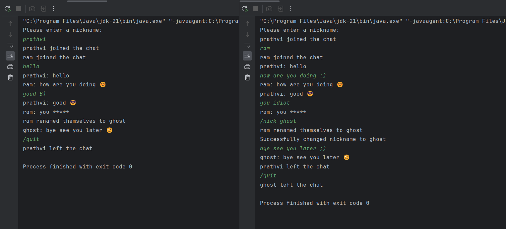

# 💬 Simple Chat Application

This is a simple chat application implemented in Java. It allows multiple clients to connect to a central server and exchange messages in a chat room environment.

## ⭐ Features

- **Nickname Changes**: Users can change their nicknames using the `/nick` command followed by the desired nickname.
- **Exiting the Chat**: Users can exit the chat room by typing the `/quit` command.
- **Content Moderation**: The application filters out offensive language using a predefined list of cuss words and replaces them with asterisks.
- **Emoji Converter**: Text representations of emojis, such as `:)` or `:(`, are converted to their corresponding emojis for visual representation.

## 💻Usage

1. **Server Setup**:
   - Compile and run the `Server.java` file to start the server.
   - The server will listen for incoming connections on port `9999`.

2. **Client Setup**:
   - Compile and run the `Client.java` file to start a client.
   - Connect to the server by providing the server's IP address and port number (`127.0.0.1:9999` if running locally).
   - Choose a nickname when prompted.

3. **Chatting**:
   - Type your messages in the client console and press Enter to send them to the chat room.
   - Use the `/nick` command followed by a new nickname to change your nickname.
   - Use the `/quit` command to exit the chat room.

## ✅ Dependencies

- Java SDK 8 or higher

## 📸 Example Screenshot


##  💻 Installation

1. Clone the repository:

   ```bash
   git clone https://github.com/Prathvi-Shetty29/TCP-Chat-Room.git
